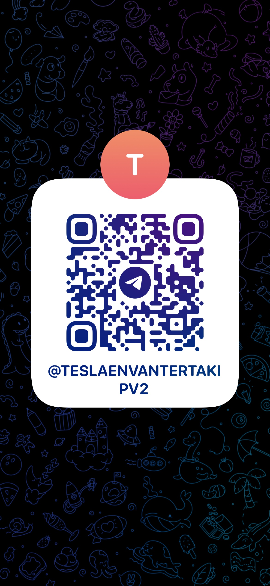

# 🇹🇷 **Türkiye Tesla Envanter Takip Grubu**

Türkiye'deki Tesla envanterini anlık takip etmek isteyenler için Telegram grubumuz açıldı!

👉 **Gruba katılmak için:** [@teslaEnvanterTakipV2](https://t.me/teslaEnvanterTakipV2)

Aşağıdaki QR kodunu okutarak da doğrudan katılabilirsiniz:



---

# 🚗 Tesla Inventory Monitoring Bot

A real-time Tesla inventory monitoring bot that checks Tesla's official inventory API at regular intervals and sends notifications via Telegram when new vehicles are available or when errors occur.

## ✨ Features

- 🕐 **Real-time monitoring** - Checks Tesla inventory every 10 seconds
- ⏰ **Active hours support** - Only works between specified hours (Istanbul time, e.g. 18:25-22:00)
- 📱 **Telegram notifications** - Instant notifications for new vehicles and errors
- 🔗 **VIN Links** - Direct links to Tesla order pages for each vehicle
- 🌍 **Multi-market support** - Easy configuration for different countries
- 🔄 **Sequential proxy rotation** - Uses proxies in order for each request
- 📦 **Detailed notifications** - Sends detailed information for each vehicle individually
- ⚠️ **Smart error handling** - First error and 30-minute continuous error notifications
- 🔄 **Automatic retry** - Automatic retry on connection issues
- 📊 **Detailed logging** - All operations are logged and stored
- 🛡️ **Graceful shutdown** - Safe shutdown support
- 🐳 **Docker support** - Run in containerized environment
- 🔧 **Easy setup** - Start with single command
- 🆕 **Dual chat support** - Send new vehicles to separate chat ID
- 🚫 **Duplicate prevention** - Prevents sending same VIN multiple times
- 💾 **Persistent VIN storage** - Remembers sent VINs across restarts

---

### 3. Environment Variables

```bash
# Required - Telegram notifications
export TELEGRAM_BOT_TOKEN="your_bot_token_here"
export TELEGRAM_CHAT_ID="your_chat_id_here"

# Optional - New vehicles chat ID (if not set, uses main chat ID)
export TELEGRAM_NEW_CARS_CHAT_ID="your_new_cars_chat_id_here"

# Optional - Tesla market settings (default: DE/de)
export TESLA_MARKET="DE"      # Country code (DE, TR, US, CA, etc.)
export TESLA_LANGUAGE="de"    # Language code (de, tr, en, etc.)

# Optional - Bot active hours (Istanbul time, 24h format)
export BOT_ACTIVE_START="18:25"
export BOT_ACTIVE_END="22:00"
```

### 4. Start the Bot

```bash
# Build the project
mvn clean package

# Run the bot
java -jar target/tesla-inventory-bot-1.0.0.jar
```

**Or use the automatic startup script:**

```bash
chmod +x start.sh
./start.sh
```

## 📋 Usage

### Normal Operation

When the bot starts:

1. First checks Tesla inventory
2. Performs regular checks every 10 seconds
3. Sends notifications when new vehicles arrive (with VIN links)
4. Sends notifications on API errors
5. Sends repeat notifications after 30 minutes of continuous errors
6. Uses proxies sequentially (one by one) for each request
7. Sends detailed information for each vehicle individually
8. Prevents duplicate VIN notifications
9. Sends new vehicles to separate chat ID if configured

### Notification Types

#### 🎉 New Vehicle Notification (Sample)

```
2025 my Model Y Long Range Rear-Wheel Drive
Fiyat: 53935 EUR
VIN: XP7Y218_0343fa7c0c704d2f48e0a38f4b0b47e1
Renk: WHITE
İç Mekan: PREMIUM_WHITE

Tesla'da Görüntüle: https://www.tesla.com/...
```

#### 📊 Initial Inventory Status

```
2025 my Model Y Long Range Rear-Wheel Drive
Fiyat: 53935 EUR
VIN: XP7Y218_0343fa7c0c704d2f48e0a38f4b0b47e1
Renk: WHITE
İç Mekan: PREMIUM_WHITE

Tesla'da Görüntüle: https://www.tesla.com/...
```

#### ❌ First Error Notification

```
❌ Tesla API access error: timeout
```

#### ⚠️ Continuous Error Notification

```
⚠️ Tesla API error continues for 30 minutes: timeout
```

### Logs

Bot logs are stored in `logs/tesla-bot.log`:

```bash
# Live log tracking
tail -f logs/tesla-bot.log

# Last 50 lines
tail -50 logs/tesla-bot.log
```

## 🌍 Market Configuration

### Supported Markets

| Country | Market | Language | Super Region  |
| ------- | ------ | -------- | ------------- |
| Germany | `DE`   | `de`     | europe        |
| Turkey  | `TR`   | `tr`     | europe        |
| USA     | `US`   | `en`     | north america |
| Canada  | `CA`   | `en`     | north america |
| UK      | `GB`   | `en`     | europe        |
| France  | `FR`   | `fr`     | europe        |
| Italy   | `IT`   | `it`     | europe        |
| Spain   | `ES`   | `es`     | europe        |

### Market Change Examples

```bash
# For Turkey
export TESLA_MARKET="TR" && export TESLA_LANGUAGE="tr"

# For USA
export TESLA_MARKET="US" && export TESLA_LANGUAGE="en"

# For UK
export TESLA_MARKET="GB" && export TESLA_LANGUAGE="en"
```

## 🐳 Docker Usage

### Docker Hub Image

```bash
# Pull and run from Docker Hub
docker run -d \
  --name tesla-bot \
  -e TELEGRAM_BOT_TOKEN="your_bot_token" \
  -e TELEGRAM_CHAT_ID="your_chat_id" \
  -e TESLA_MARKET="TR" \
  -e TESLA_LANGUAGE="tr" \
  aydinozturk/tesla-inventory-bot:latest
```

### Docker Compose (Recommended)

```yaml
version: "3.8"
services:
  tesla-bot:
    image: aydinozturk/tesla-inventory-bot:latest
    container_name: tesla-inventory-bot
    environment:
      - TELEGRAM_BOT_TOKEN=your_bot_token
      - TELEGRAM_CHAT_ID=your_chat_id
      - TESLA_MARKET=TR
      - TESLA_LANGUAGE=tr
    volumes:
      - ./logs:/app/logs
    restart: unless-stopped
```

```bash
# Start with docker-compose
docker-compose up -d

# Follow logs
docker-compose logs -f tesla-bot
```

### Manual Docker Build

```bash
# Build image
docker build -t tesla-inventory-bot .

# Run container
docker run -d \
  --name tesla-bot \
  -e TELEGRAM_BOT_TOKEN="your_bot_token" \
  -e TELEGRAM_CHAT_ID="your_chat_id" \
  -e TESLA_MARKET="DE" \
  -e TESLA_LANGUAGE="de" \
  -v $(pwd)/logs:/app/logs \
  tesla-inventory-bot
```

## ⚙️ Configuration

### Environment Variables

| Variable                    | Description          | Required | Default      |
| --------------------------- | -------------------- | -------- | ------------ |
| `TELEGRAM_BOT_TOKEN`        | Telegram bot token   | ✅       | -            |
| `TELEGRAM_CHAT_ID`          | Telegram chat id     | ✅       | -            |
| `TELEGRAM_NEW_CARS_CHAT_ID` | New vehicles chat id | ❌       | Main chat ID |
| `TESLA_MARKET`              | Tesla market code    | ❌       | `DE`         |
| `TESLA_LANGUAGE`            | Tesla language code  | ❌       | `de`         |

### Proxy Configuration

The bot automatically uses proxies from `proxy-list.txt` file:

- Each request uses the next proxy in sequence from the list
- If no proxies are available, requests are made directly
- Proxy format: `IP:PORT` (one per line)

Example `proxy-list.txt`:

```
154.213.198.89:3129
154.213.203.129:3129
156.233.85.174:3129
```

### VIN Duplicate Prevention

The bot automatically prevents sending the same VIN multiple times:

- All sent VINs are stored in `sent_vins.txt` file
- VINs are remembered across bot restarts
- Only new VINs trigger notifications
- File is automatically updated when new vehicles are found

## 🔧 Technical Details

### API Endpoints

- **Tesla Inventory API**: `https://www.tesla.com/coinorder/api/v4/inventory-results`

### Request Headers

```http
User-Agent: Mozilla/5.0 (Macintosh; Intel Mac OS X 10_15_7) AppleWebKit/537.36
Accept: application/json
```

### Response Format

Tesla API returns JSON with vehicle inventory data including VIN numbers, which are used to generate direct order links.

## 🚀 Development

### Building from Source

```bash
# Clone repository
git clone https://github.com/aydinozturk/tesla-bot.git
cd tesla-bot

# Build with Maven
mvn clean package

# Run tests
mvn test
```
